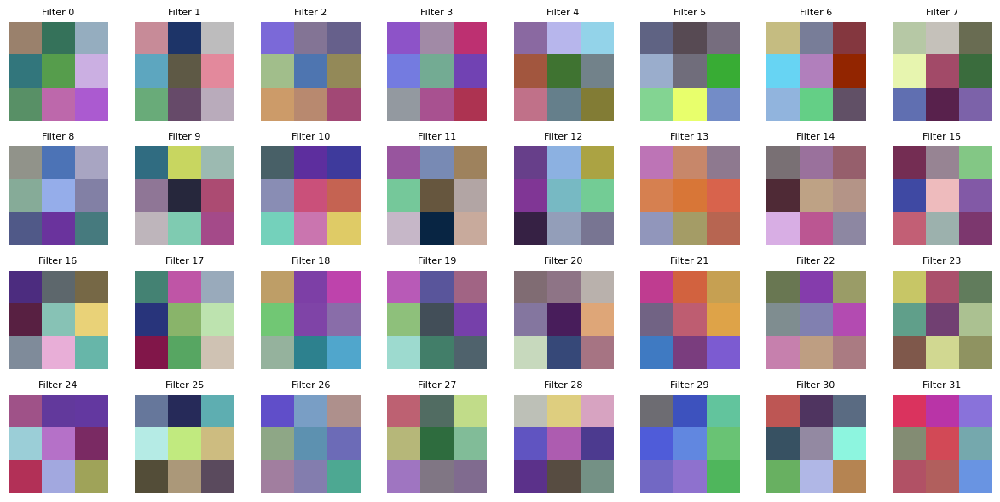
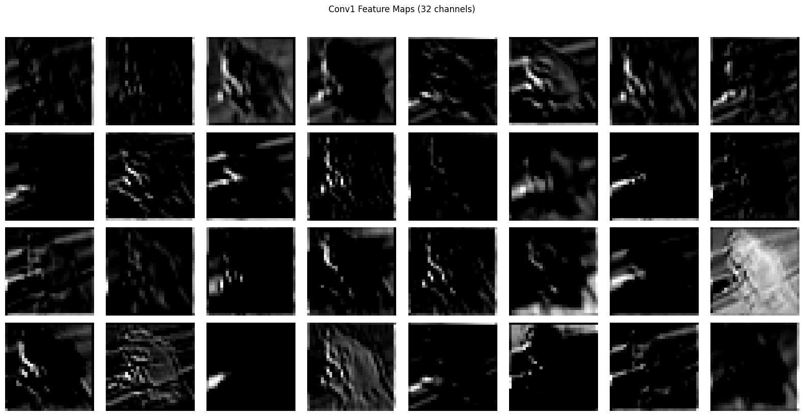
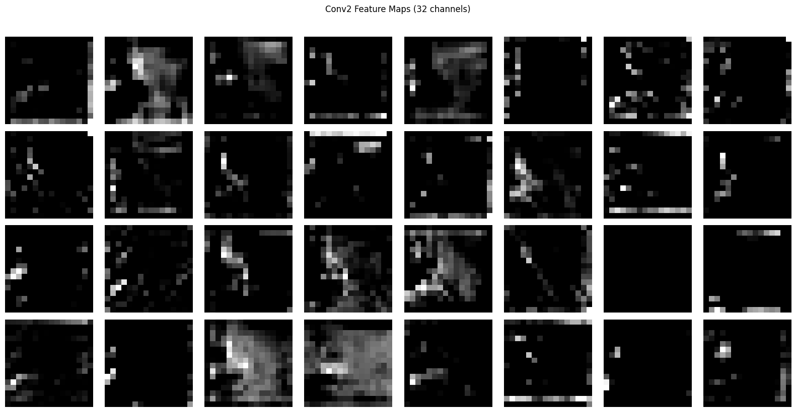
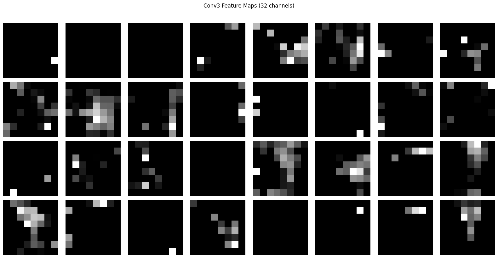
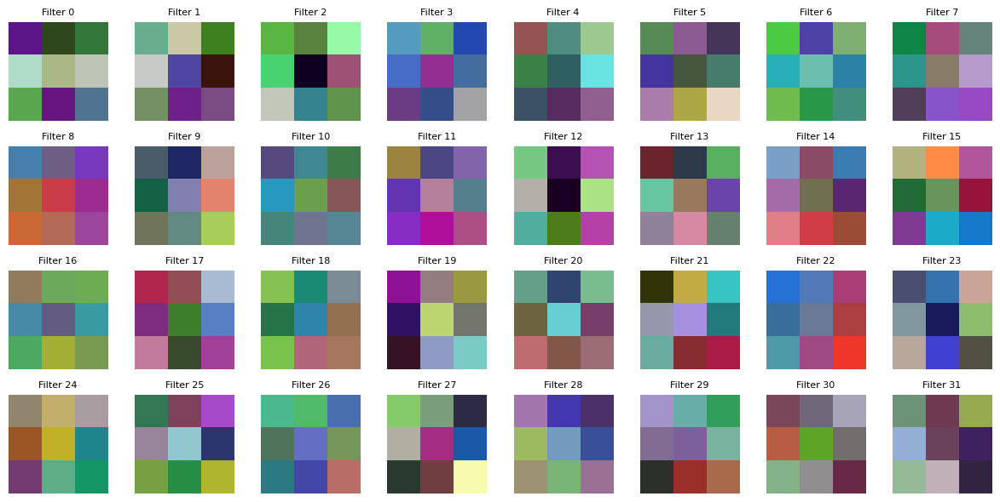

# Day 2 — Visualization + Augmentation Ablation

## What I built
- Loaded the Day 1 trained model from Drive.
- Visualized all 32 filters of conv1 as RGB images.
- Visualized feature maps from conv1, conv2, conv3 for one CIFAR-10 test image.
- (Block 4 — fill in once done) Trained a second model with RandomCrop + HorizontalFlip augmentation and compared to baseline.

---

## Block 2 — Filter visualization
### What I expected vs what I saw (conv1 filters)

Expected: edge detectors (one bright side, one dark side across the 3×3 patch).
Saw: mostly color and color-gradient detectors. Very few filters showed clean edge structure.

### Filter observations
- Closest to edge-like: Filter 8, 26, 27 — soft directional brightness gradients, not sharp edges.
- Color-gradient detectors: Filter 6 (diagonal yellow→red), Filter 23 (vertical color gradient), Filter 16 (directional color opponency).
- Center-surround patterns: Filter 21 (red center, darker surround).
- Mottled/mixed patches without obvious structure: roughly half the filters.

### Why the filters looked the way they did (initial hypothesis)
- 3×3 filter size is too small to display edges crisply; textbook edge-detector visualizations come from 7×7 or 11×11 conv1 layers in AlexNet/ResNet.
- CIFAR-10's 32×32 images don't have fine-grained edge structure; the dataset is highly color-discriminable (sky/grass/fur backgrounds dominate).
- Only 10 epochs of unregularized training, with overfitting starting at epoch 7. Filters often become more interpretable with longer, better-regularized training.

---

## Block 3 — Feature map visualization

### Updated interpretation after seeing feature maps
Initial filter visualization suggested conv1 had learned mostly color and gradient detectors, with no clean edges. Feature maps on a real test image contradict this — the channels are dominated by edge-like responses tracing the animal's outline. The filters are functionally edge-detector-ish even though their raw weights don't visually appear that way. This is a useful reminder that filter inspection alone is a lossy diagnostic; feature maps reveal the actual learned behavior.

### Feature map observations
Input image: class Frog

- **Conv1 (32 channels, 32×32 spatial):**
 
edge-like responses on most channels, tracing the animal's outline; several channels emphasize different body parts (limbs, torso, head); a few channels mostly dark, indicating filters that don't fire on this particular image. One channel showed an inverted/blob response — bright body, dark background — likely a uniform-region detector rather than an edge detector.
- **Conv2 (16×16 spatial, first 32 of 64 channels):** 

spatial resolution is halved and responses become blockier. Many channels show activity concentrated in only one region of the image — a corner, a strip, a blob — rather than tracing the full animal outline. The shape is still vaguely recognizable in some channels but the network is starting to make spatial decisions about *where* interesting things are, rather than outlining everything.
- **Conv3 (8×8 spatial, first 32 of 128 channels):** 

the animal shape is gone. Most channels are entirely black or contain only 1–3 bright pixels. Each lit pixel represents the presence of a concept somewhere within a ~12×12 region of the original image (the receptive field), not a specific pixel location. Roughly two-thirds of the displayed channels are dark, meaning those concept detectors did not fire on this particular image.

### Key insights from Block 3

**On filter inspection:** Visual inspection of filter weights is a *lossy* diagnostic. The same filter that looks like a "mottled color patch" in weight space can produce clean edge-like responses on real inputs, because the three input channels combine in nonobvious ways and ReLU sharpens the output. Feature maps are usually more informative than filters for understanding what a network has learned.

**On increasing abstraction:** Going conv1 → conv2 → conv3, the feature maps progress from "full edge outlines of the input" to "spatially concentrated patches" to "sparse single-pixel activations." Each conv3 pixel summarizes a ~12×12 region of the original image, so what looks like one lit pixel is really "this concept is present somewhere in this image-region." This is exactly the textbook "edges → parts → concepts" hierarchy, observed in my own trained model.

**On sparsity:** At conv3, most channels are entirely black for any given input image. This is intentional — out of 128 specialized concept detectors, only the ones relevant to the input class should fire. Sparsity at deep layers is what makes the final fully-connected classifier's job tractable: it just needs to read off which subset of 128 concepts is present.

---

## Block 4 — Data augmentation ablation

### Hypothesis
Adding RandomCrop and RandomHorizontalFlip to the training transforms should reduce overfitting because the model sees more varied examples and cannot memorize the training set as easily. Expected effects: lower train accuracy, higher test accuracy, smaller train/test gap.

### What I changed
- Added `transforms.RandomCrop(32, padding=4)` and `transforms.RandomHorizontalFlip()` to the training transform.
- Test transform unchanged (test data is never augmented).
- All other hyperparameters identical to Day 1: same architecture, Adam lr=1e-3, 10 epochs, batch size 64.

### Result
- Day 1 baseline test acc: 75.28%
- Day 2 augmented test acc: 78.5%
- Δ test acc: 3.22%
- Train/test gap: shrank from 19.18% to .57%

### Did augmented filters look different?

Only visible change in the filters are their color patters has change than before.

---

## Ablation table (running)

| Experiment | Train Acc | Test Acc | Train-Test Gap | Δ Test vs Baseline |
|------------|-----------|----------|----------------|---------------------|
| Day 1: Baseline (no augmentation) | 94.46% | 75.28% | 19.18% | — |
| Day 2: + RandomCrop + HorizontalFlip | 77.93% | 78.50% | .57% | 3.2% |

---

## Reflection

### What clicked today
- After visualizing the feature maps and filters shape it's clear that the model is detecting edges, shapes, colors etc

### What's still fuzzy
- It would be more benificial if the part what to detect were controlable

### Time spent
- 04 hours
